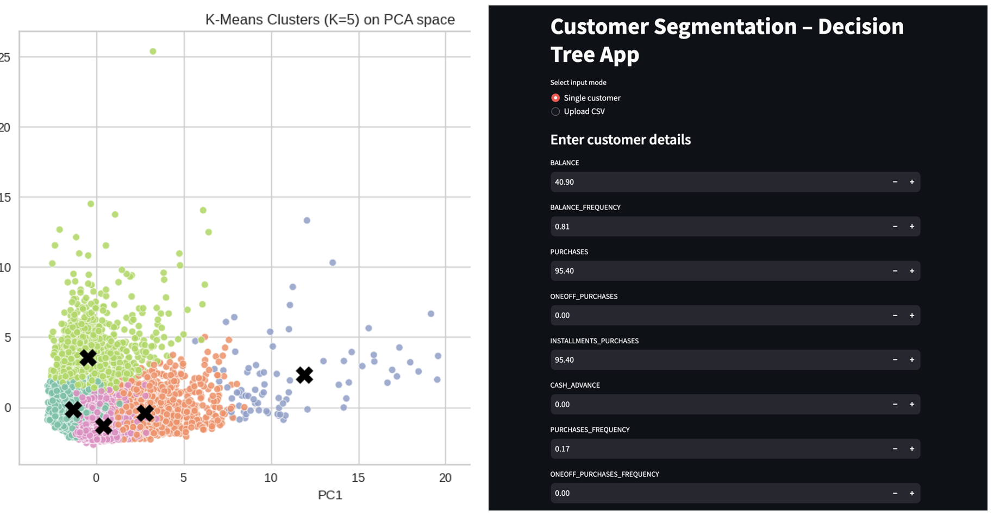

  

<h1 align="center">Banking Customer Behaviour Segmentation Engine</h1>

<h3 align="center">
  PCA • K-Means Clustering • Decision Tree Classification • Streamlit Deployment
</h3>

  An end-to-end machine learning system for analysing credit-card customer behaviour,
  segmenting users, and classifying new customers for banking and financial services.

